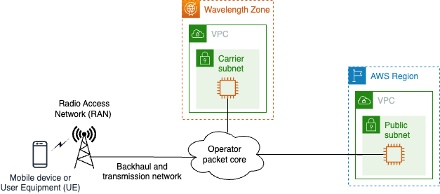

#  AWS Wavelength Latency Benchmarking

This repository contains code for a simple iOS app that compares the *TCP round-robin* (TCP_RR) results of [netperf](https://hewlettpackard.github.io/netperf/) from two servers. There is also an AWS CloudFormation template that will build suitable servers in an AWS Region and, optionally, an AWS Wavelength Zone.

You can read more about this topic in the forthcoming blog post *Lower access latency for your apps with AWS Wavelength and our telco partners* on the AWS telco blog page.

## [AWS Wavelength](https://aws.amazon.com/wavelength/)

When AWS and a telecom operator partner to build a Wavelength Zone, AWS compute and storage services are embedded within telco providers’ data centers at the edge of the 5G network. This placement aims to minimize network latency by reducing the physical distance and number of network hops that the packets traverse.

### Evaluating Wavelength Zones for your needs

There are many factors that can affect the round-trip latency between an app on a user's mobile device and its AWS resources in the Region or Wavelength Zone. Some examples of these are: the device's physical location, the mobile network design, the mobile core site locations, the packet core technology (4G or 5G), and the locations of the AZs that make up the closest Region.

One of the strongest benefits of the AWS cloud  is that common APIs and services are available whether running in a Region, a Wavelength Zone, or other types of AWS compute infrastructure. This gives developers a “write once, run anywhere” experience. However, even taking this into account, moving resources from a Region to a Wavelength Zone takes some development and operational effort. In addition, Amazon Elastic Compute Cloud (Amazon EC2) instances and other AWS resources in Wavelength Zones may have different prices than in the parent Region. Therefore, it is logical to evaluate whether the reduction in round-trip latency justifies these incremental investments. 

